<p align="center">
  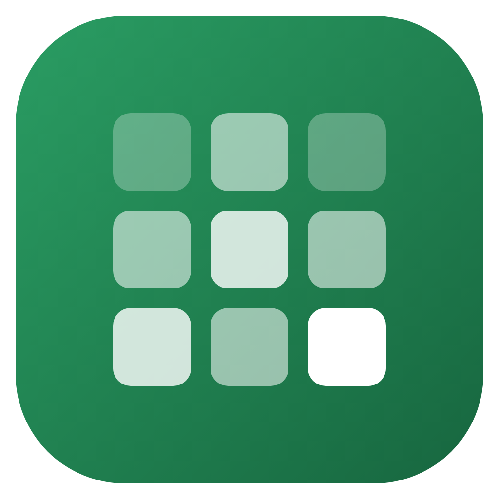
</p>

<h1 align="center">Study Tracker · 讀書紀錄</h1>

<p align="center">
  A calm little Windows and Mac app to set study goals, plan sessions, time them, and see your progress,<br>
  focused on the next few days rather than months of history.<br><br>
  一個簡潔的 Windows／Mac 讀書小幫手：設定目標、規劃讀書計畫、計時、追蹤進度，<br>
  只專注在眼前這幾天。
</p>

<p align="center">
  <a href="#en"><b>English</b></a> &nbsp;·&nbsp; <a href="#zh"><b>繁體中文</b></a>
</p>

<p align="center">
  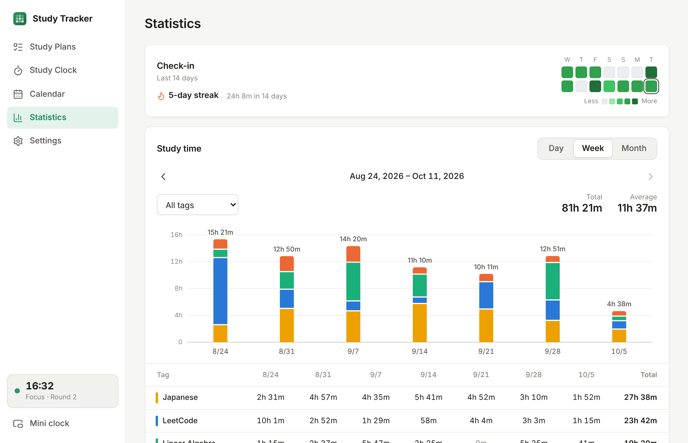
</p>

---

<a id="en"></a>

## English

### Why Study Tracker?

Most study apps pile everything you have ever done into ever-growing charts. Study Tracker keeps a deliberately **short horizon**: a 14-day check-in grid, a 3-day calendar, and a clock that is always one click away, so your attention stays on today. Your bigger goals live in their own tab, broken into small checkpoints you can tick off.

### Features

#### 🎯 Goals

Create a goal such as *Study LLMs* and break it into **checkpoints**: *Transformer architecture → Attention is all you need → llama.cpp → …*. Goals and checkpoints can each have a tag.

- Goals are grouped into **Current**, **Upcoming** and **Completed**.
- Finish a goal by marking it **completed**, or give it **target hours** and it completes itself once you have studied that long.
- Open a goal to see its progress, hours studied, days left, time spent on each checkpoint, weekly study time, and upcoming plans.

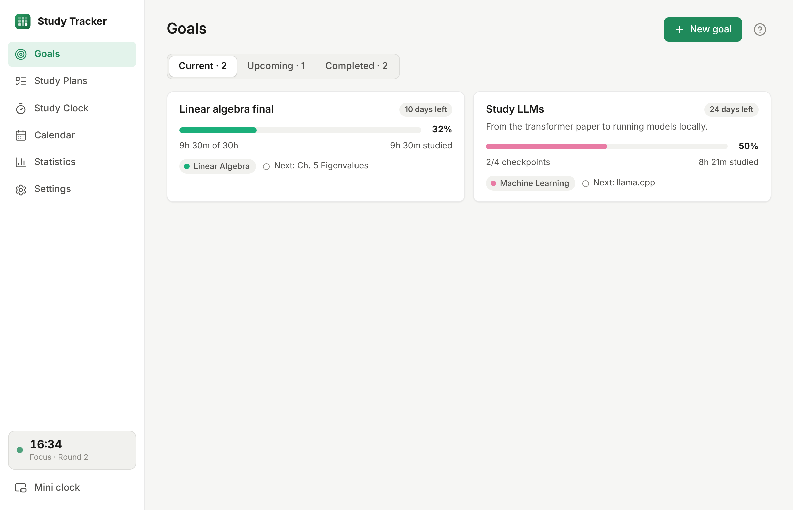

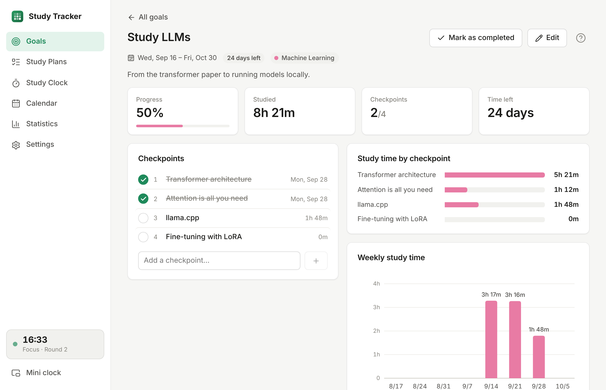

#### 📋 Study Plans

Write down what you are going to study: a **title, date, start time, duration, tag** (e.g. *LeetCode*, *English*) and **notes**. A new plan starts at the current date and time.

As you type the title, **matching goals appear**. Pick a goal, then one of its checkpoints, and the plan is linked to it: the title and tag fill in for you. Each plan shows how much you have actually studied against it.

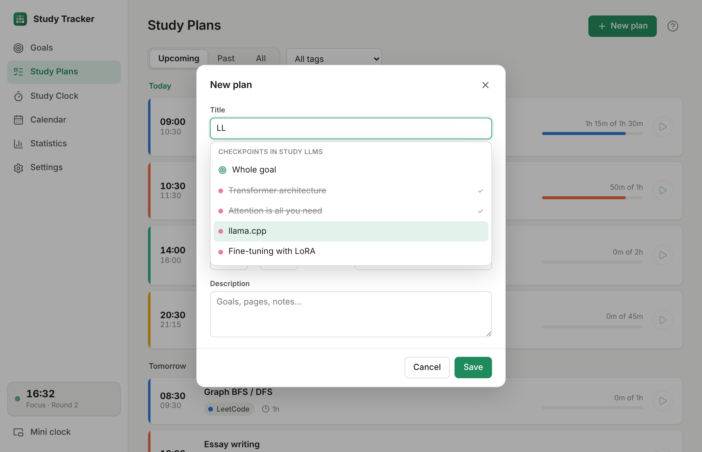

Press **▶** on a plan, or **right-click → Start timer**, to start a countdown for the **time left** on that plan (planned minus already studied). If there is no time left, nothing happens.

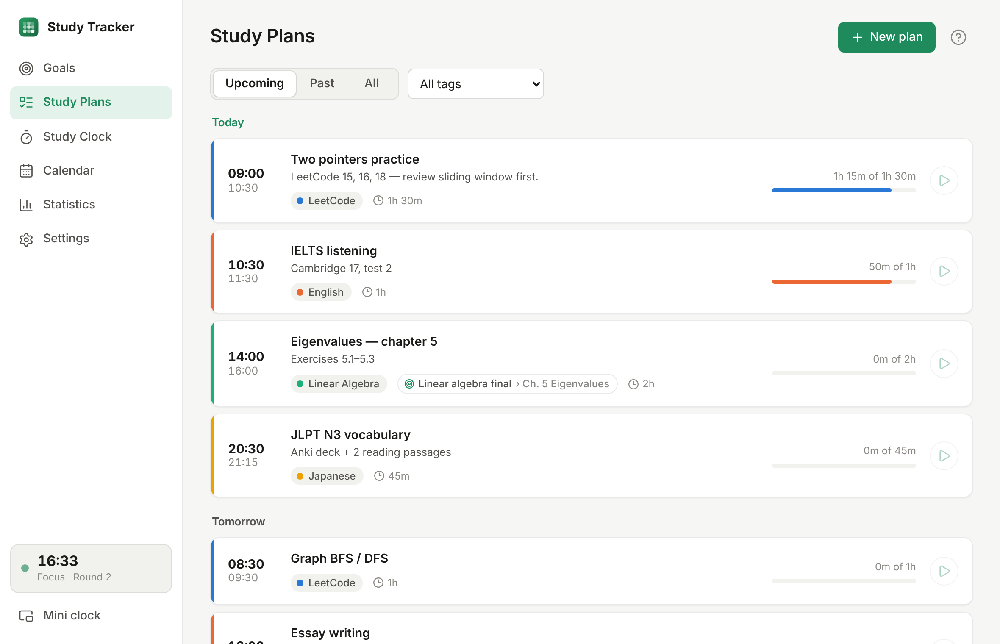

#### ⏱️ Study Clock

Three modes:

- **Stopwatch**: counts up while you study
- **Countdown**: set a duration and go
- **Pomodoro**: choose your own focus, short break and long break lengths, and how often the long break comes

Only focused time is recorded; pauses and breaks don't count. Link a session to a tag or plan before you start, or afterwards from *Today's sessions*. Forgot to start the timer? Log the time by hand.

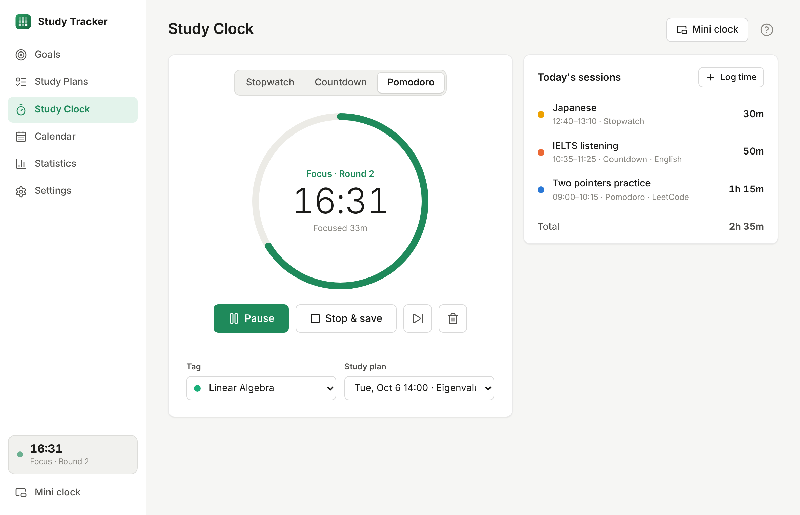

**Mini clock**: a small always-on-top window, so the timer stays visible while you work in other apps.

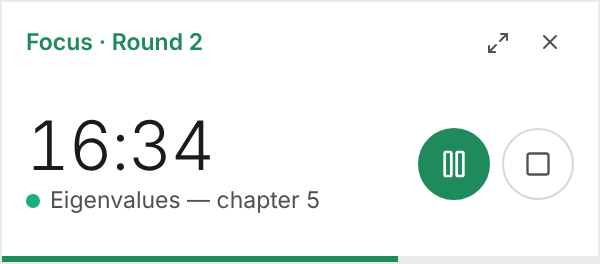

#### 📅 3-Day Calendar

Today, tomorrow and the day after on an hourly grid, like Google Calendar.

- **Click an empty slot** to add a plan at that time.
- **Click a plan** to edit it.
- **Right-click a plan → Start timer** to jump to the Study Clock and count down its time left.

A red line marks the current time, and plans that run past midnight continue into the next day.

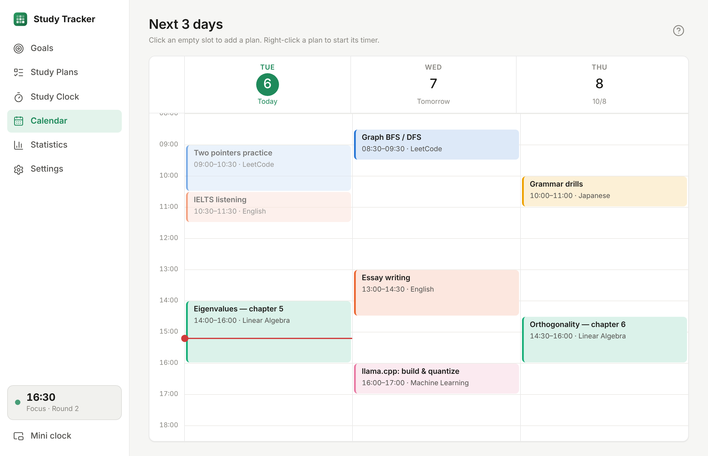

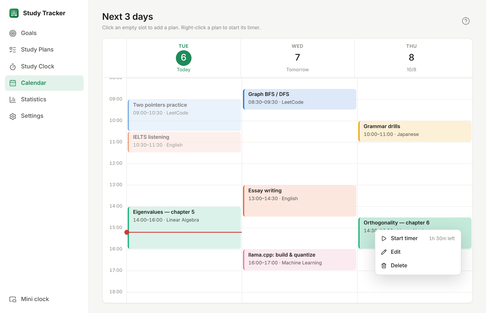

#### 📊 Statistics

- **Check-in**: a GitHub-style grid of the last 14 days. The darker the green, the longer you studied (none · under 30 min · 30–60 min · 1–3 h · 3 h+). Your current streak is shown next to it.
- **Study time**: a bar chart by **day, week or month**, each bar split by tag colour. Hover a bar for the details, or filter to a single tag.
- **By tag**: a table with each tag's time in every period.

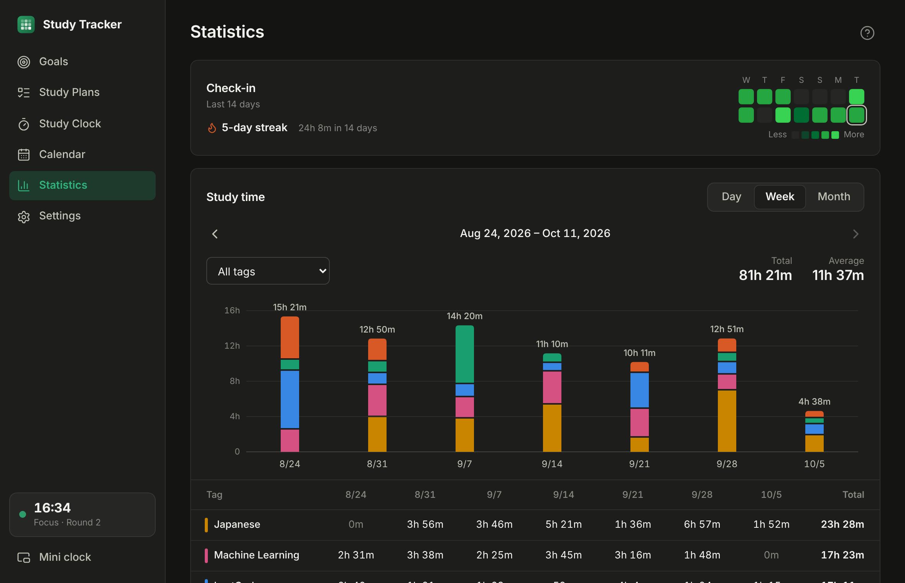

#### ❓ Built-in help

Press the **?** button at the top right of any page for a short tour of pop-up cards. It opens on the card for the page you are on, and shows once automatically the first time you launch the app.

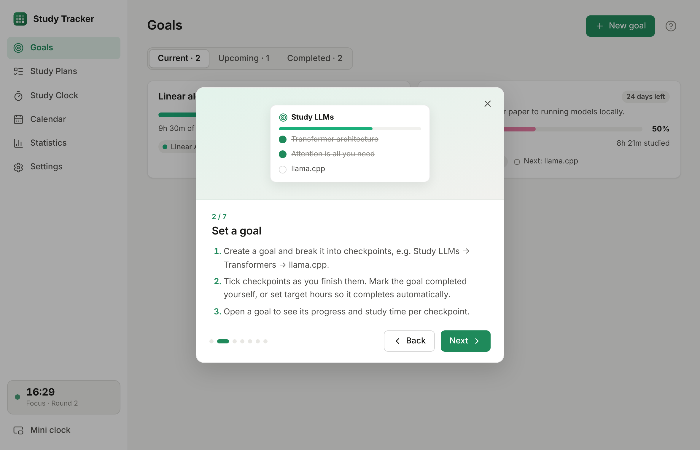

#### 🤖 Use with Claude (optional)

Study Tracker has no AI built in. If you use the **Claude desktop app**, you can let Claude work with your study data from there:

1. In Study Tracker, open **Settings → Claude connector → Connect to Claude desktop**.
2. Restart the Claude desktop app.
3. Ask Claude things like:
   - *"I want to learn transformer architecture in 4 weeks, about an hour on weekday evenings. Set it up in Study Tracker."*
   - *"How am I doing this week? If I'm behind, move Thursday's session to Saturday morning."*
   - *"Tick off the Encoder checkpoint."*

Claude asks your permission before it uses Study Tracker. It can read your goals, plans and study time, and create or edit goals, checkpoints and plans; changes show up in Study Tracker right away. It **cannot** change your recorded study time, and it can delete a goal only when it is an exact duplicate. Before its first change each day, a backup is saved in the `backups` folder next to your data.

Works with the installer version (not the portable one), with the Claude desktop app on the same computer.

#### ✨ And also

- English and 繁體中文 interface
- Light, dark, or follow your system setting
- Silent notifications when a countdown ends or a pomodoro phase changes
- Export / import everything as one JSON backup file
- **Private by design**: no account, no cloud. Everything stays on your PC.

### Download & install

Download the file for your computer from the [**latest release**](https://github.com/AndyLu1114/study_tracker/releases/latest). No GitHub account needed.

**Windows 10 / 11**
- `StudyTracker-Setup-x.y.z.exe` installs the app with a Start menu shortcut (needed for the Claude connector).
- `StudyTracker-Portable-x.y.z.exe` runs straight away, without installing.
- If Windows shows *"Windows protected your PC"*, click **More info → Run anyway**. This appears because the app is not code-signed.

**Mac** (Apple Silicon and Intel)
- Open `StudyTracker-x.y.z-mac.dmg` and drag **Study Tracker** into **Applications**.
- The first time you open it, macOS may block it because it isn't from an identified developer. Go to **System Settings → Privacy & Security** and click **Open Anyway**. You only need to do this once.

### Your data

Everything is saved on your own computer: `%APPDATA%\Study Tracker\study-data.json` on Windows, `~/Library/Application Support/Study Tracker/study-data.json` on Mac. Uninstalling the app does not delete it. To move to a new PC or keep a backup, use **Settings → Backup → Export**, then **Import** on the other machine.

---

<a id="zh"></a>

## 繁體中文

### 為什麼做這個 App？

很多讀書 App 會把你所有的紀錄堆成越來越大的圖表。「讀書紀錄」刻意**只看近期**：14 天的打卡表、3 天的行事曆，再加上一鍵就能開始的計時器，讓你把注意力放在今天。較長期的目標則放在獨立的分頁，拆成一個個可以打勾的小檢查點。

### 功能

#### 🎯 目標

建立一個目標，例如「學習大型語言模型」，再拆成幾個**檢查點**：Transformer 架構 → Attention 論文 → llama.cpp → …。目標與檢查點都可以設定標籤。

- 目標分成**進行中**、**即將開始**、**已完成**三類。
- 可以自己把目標**標記為完成**；或設定**目標時數**，讀滿後會自動完成。
- 點開目標可以看到進度、已讀時間、剩餘天數、各檢查點的讀書時間、每週讀書時間，以及接下來的計畫。

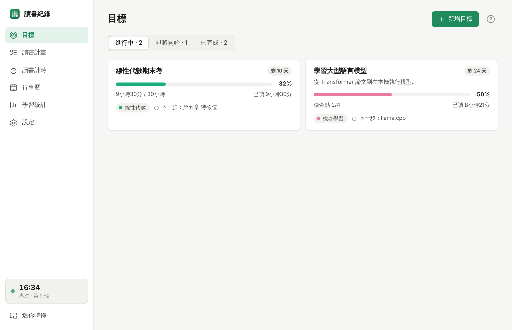

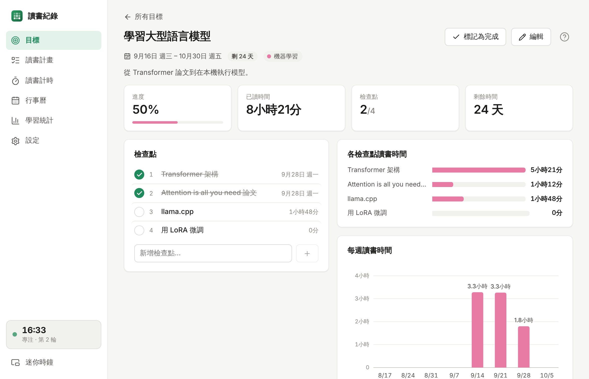

#### 📋 讀書計畫

寫下要讀什麼：**標題、日期、開始時間、時長、標籤**（例如 LeetCode、英文）與**說明**。新計畫預設為現在的日期與時間。

輸入標題時，**符合的目標會自動出現**。先選目標，再選其中一個檢查點，計畫就會連結上去，標題與標籤也會自動填好。每個計畫都會顯示你實際讀了多久。

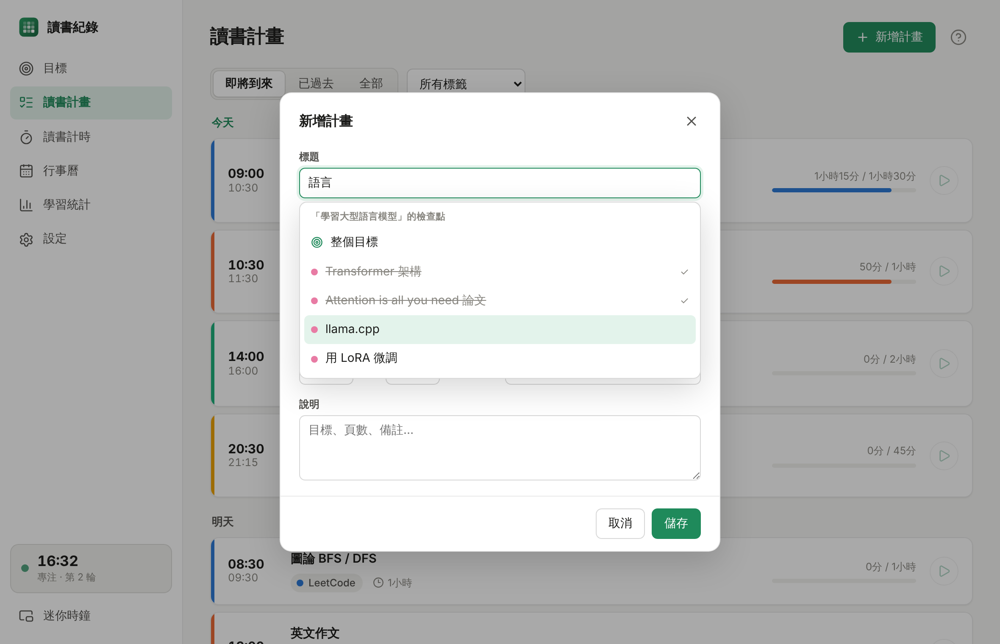

在計畫上按 **▶**，或**按右鍵 →「開始計時」**，就會倒數這個計畫的**剩餘時間**（計畫時長減去已讀時間）。沒有剩餘時間時則不會有任何動作。

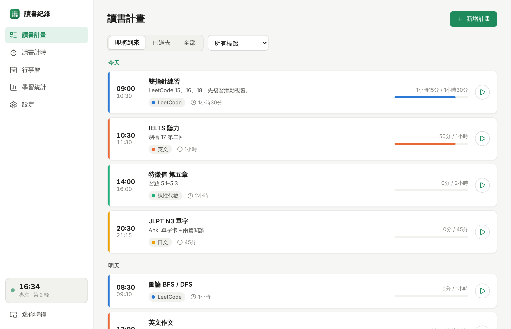

#### ⏱️ 讀書計時

三種模式：

- **碼錶**：從零開始往上計時
- **倒數計時**：設定時長後開始倒數
- **番茄鐘**：自訂專注、短休息、長休息的長度，以及每幾輪休息一次長休息

只會記錄專注的時間，暫停與休息都不算。可以在開始前，或結束後在「今日紀錄」裡，把紀錄連結到標籤或計畫。忘了開計時器？也可以手動補登。

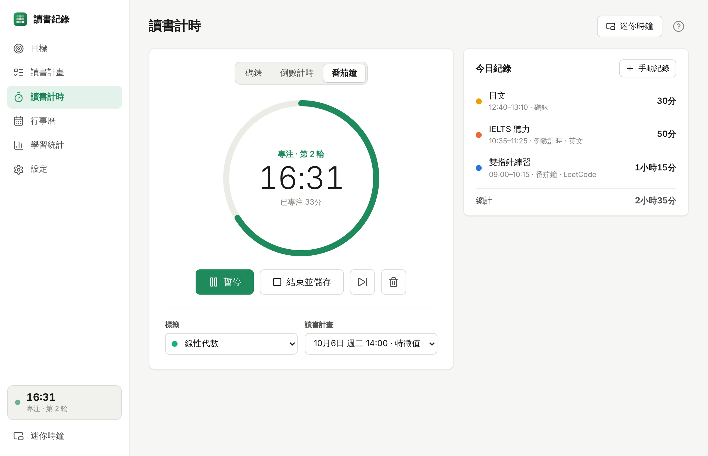

**迷你時鐘**：永遠置頂的小視窗，使用其他程式時也看得到計時。

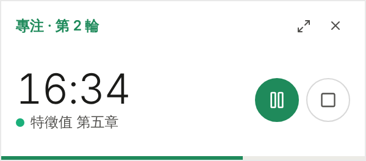

#### 📅 三天行事曆

像 Google 日曆一樣，以每小時為一格，顯示今天、明天、後天的計畫。

- **點空白時段**：在該時間新增計畫。
- **點計畫**：編輯計畫。
- **在計畫上按右鍵 →「開始計時」**：切換到讀書計時，倒數剩餘時間。

紅線標示現在時間；跨過午夜的計畫會延續到隔天。

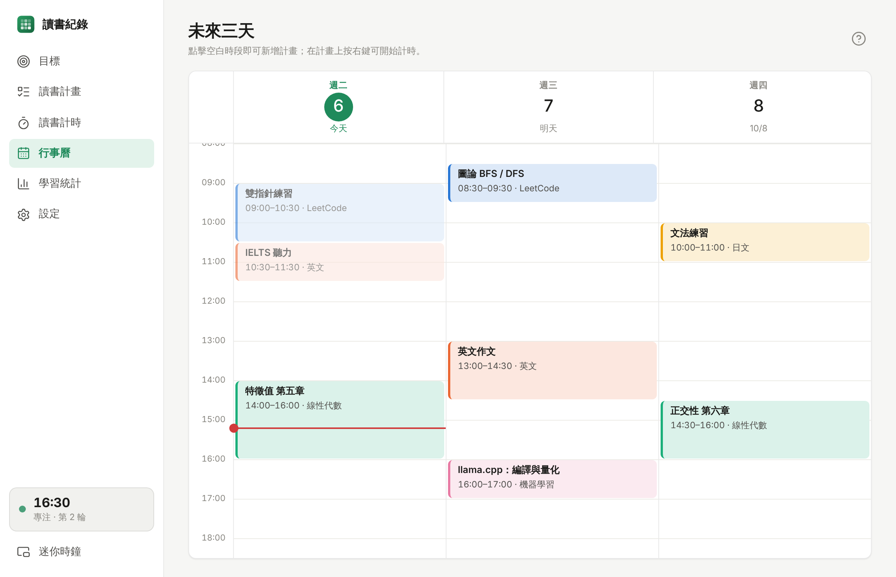

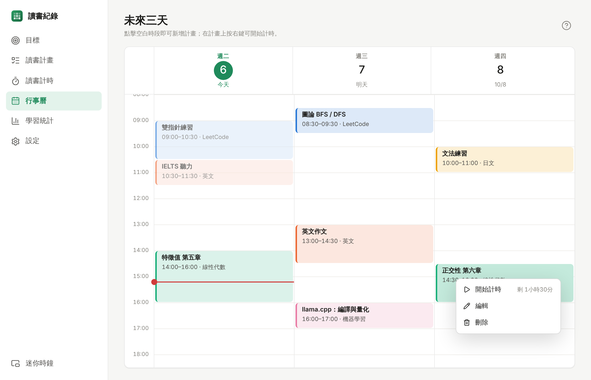

#### 📊 學習統計

- **打卡紀錄**：類似 GitHub 的方格，顯示最近 14 天。讀得越久，綠色越深（無・30 分鐘以下・30–60 分鐘・1–3 小時・3 小時以上），旁邊也會顯示連續讀書天數。
- **累積學習時間**：依**日、週、月**顯示長條圖，每根長條依標籤分色。滑鼠移到長條上可看細節，也可以只看單一標籤。
- **依標籤**：表格列出每個標籤在各期間的讀書時間。

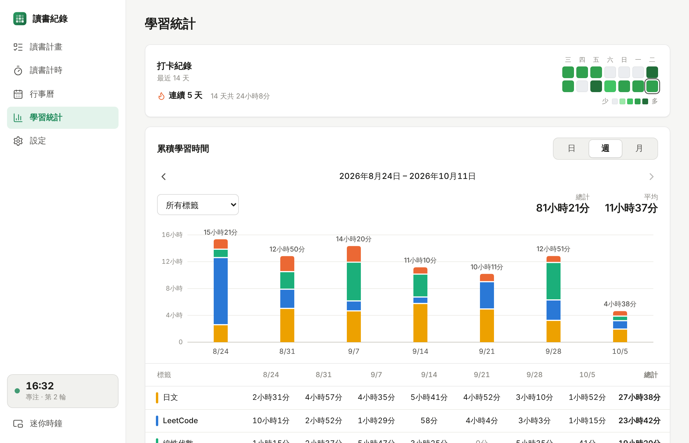

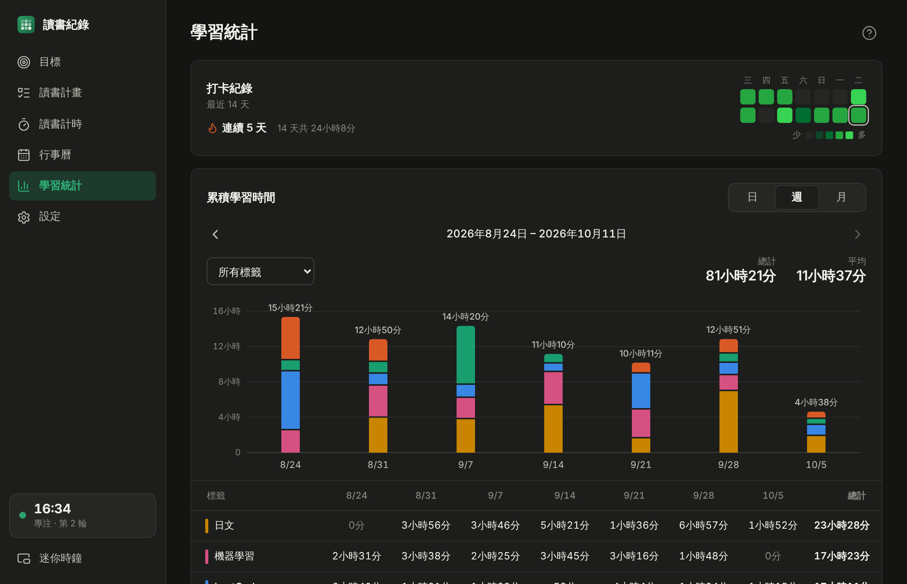

#### ❓ 內建說明

在任何頁面右上角按 **?**，就會出現簡短的導覽卡片，並從目前頁面的說明開始。第一次開啟 App 時也會自動顯示一次。

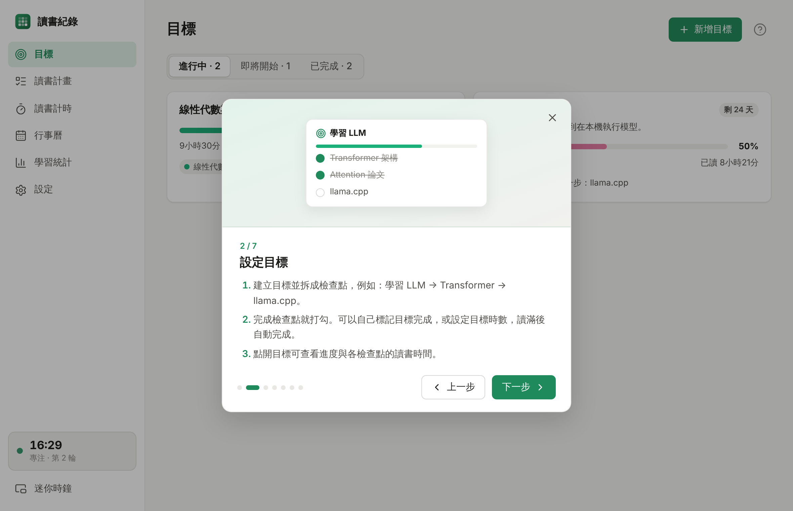

#### 🤖 搭配 Claude 使用（選用）

讀書紀錄本身不含 AI。如果你有使用 **Claude 桌面版**，可以讓 Claude 在那裡協助處理你的讀書資料：

1. 在讀書紀錄中開啟「**設定 → Claude 連接器 → 連接 Claude 桌面版**」。
2. 重新啟動 Claude 桌面版。
3. 試著問 Claude：
   - 「我想在 4 週內學會 Transformer 架構，平日晚上大約一小時。幫我在讀書紀錄裡設定好。」
   - 「我這週進度如何？如果落後了，把週四的讀書時段移到週六早上。」
   - 「把 Encoder 檢查點打勾。」

Claude 使用讀書紀錄前會先徵求你的同意。它可以讀取目標、計畫與讀書時間，也可以建立或修改目標、檢查點與計畫，變更會立即顯示在讀書紀錄中。它**無法**修改已記錄的讀書時間，也只能刪除完全重複的目標。每天第一次修改前，會在資料旁的 `backups` 資料夾自動備份。

適用於安裝版（不支援免安裝版），且 Claude 桌面版需裝在同一台電腦上。

#### ✨ 其他

- 英文／繁體中文介面
- 淺色、深色，或跟隨系統設定
- 倒數結束或番茄鐘切換階段時，顯示無聲的系統通知
- 所有資料可匯出／匯入成一個 JSON 備份檔
- **重視隱私**：不需註冊帳號、不上雲端，所有資料都存在你自己的電腦裡

### 下載與安裝

到 [**最新版本**](https://github.com/AndyLu1114/study_tracker/releases/latest) 下載適合你電腦的檔案，不需要 GitHub 帳號。

**Windows 10 / 11**
- `StudyTracker-Setup-x.y.z.exe`：安裝版，會建立開始功能表捷徑（使用 Claude 連接器需安裝版）。
- `StudyTracker-Portable-x.y.z.exe`：免安裝版，點兩下直接使用。
- 如果出現「**Windows 已保護您的電腦**」，請點「**其他資訊 → 仍要執行**」。這是因為程式沒有數位簽章。

**Mac**（Apple Silicon 與 Intel 皆可）
- 打開 `StudyTracker-x.y.z-mac.dmg`，把 **Study Tracker** 拖到「**應用程式**」。
- 第一次開啟時，macOS 可能會因為不是來自已識別的開發者而阻擋。請到「**系統設定 → 隱私權與安全性**」點「**強制打開**」，只需要做一次。

### 資料存放

所有資料都存在你自己的電腦裡：Windows 在 `%APPDATA%\Study Tracker\study-data.json`，Mac 在 `~/Library/Application Support/Study Tracker/study-data.json`。解除安裝也不會刪除。要換電腦或備份時，請到「**設定 → 備份 → 匯出**」，再到新電腦上「**匯入**」。

---

## Development · 開發

Built with Electron, React and TypeScript. Requires Node.js 22+.

```bash
npm install
npm run dev        # run the desktop app with hot reload
npm run web        # run the UI in a browser at http://localhost:5199 (data in localStorage)
npm test           # unit tests
npm run typecheck
npm run dist:win   # build the Windows installer (run on Windows)
npm run dist:mac   # build the universal Mac .dmg (run on a Mac)
npm run smoke -- <path to packaged app executable>   # launch a packaged build and check it
```

Every push runs the tests, builds the Windows and Mac apps, and smoke-tests them on GitHub Actions ([`build.yml`](.github/workflows/build.yml)). To publish a version, run **Actions → Release → Run workflow** on `main` with a version number ([`release.yml`](.github/workflows/release.yml)).

```
src/
  shared/    plain TypeScript, no Electron: data model, store operations, timer engine,
             statistics, goal progress, calendar layout, translations, the connector's
             actions, and the StudyHost that ties them together
  main/      Electron main process: windows, IPC, notifications, Claude desktop config
  node/      Node code shared by the app and the connector: file storage, backups,
             and the local channel the connector uses while the app is open
  mcp/       the Claude connector (an MCP server), bundled to out/mcp/index.cjs
  preload/   exposes the IPC API to the UI as window.studyApi
  renderer/  React UI (pages/, components/, styles.css)
```

The timer runs in the main process, so it keeps accurate time while the window is hidden, the mini clock and main window always show the same session, and a running session survives restarting the app.

## License

[MIT](LICENSE)
