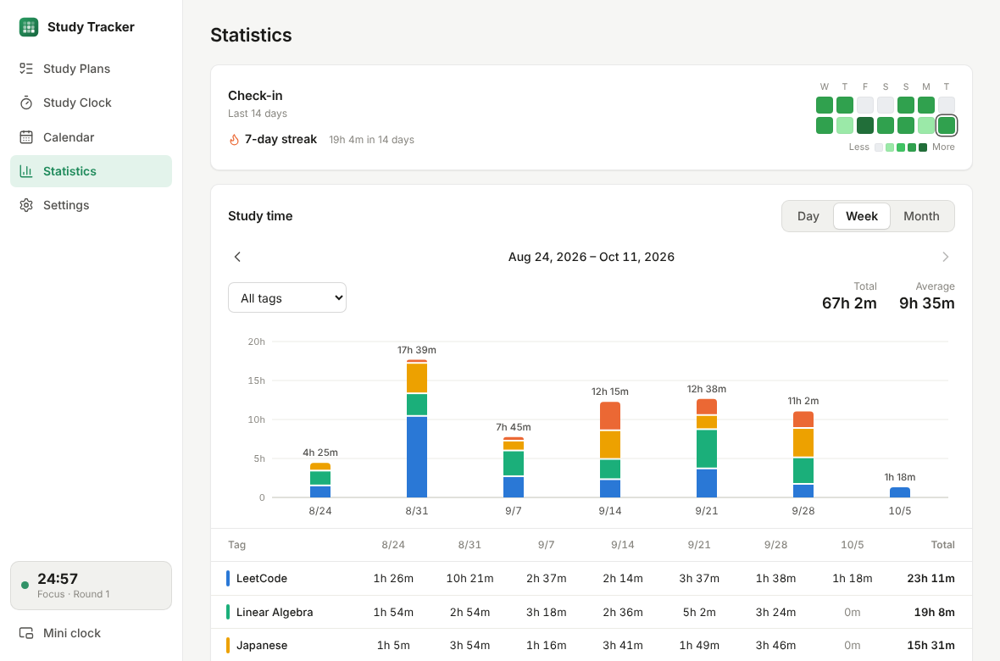
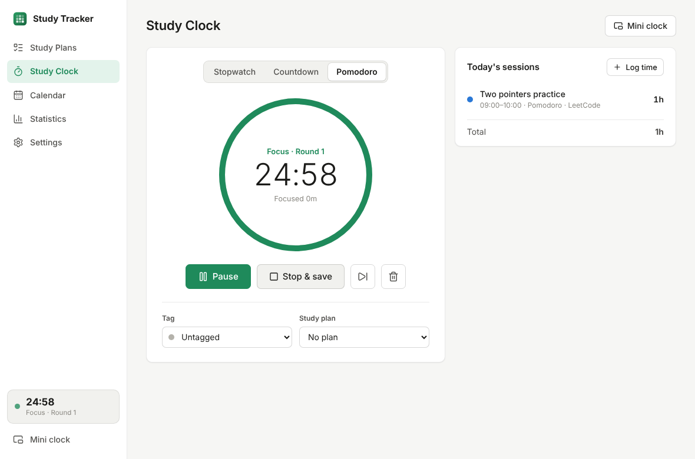
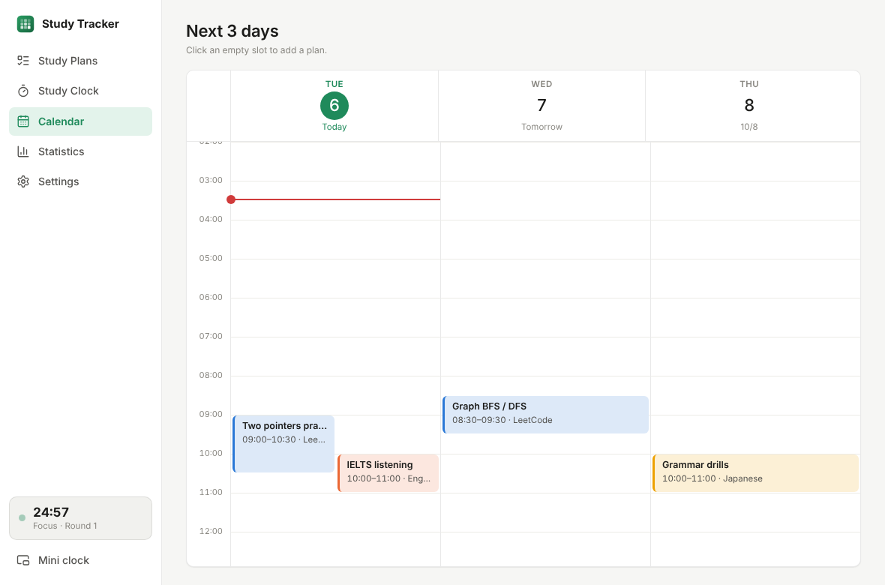
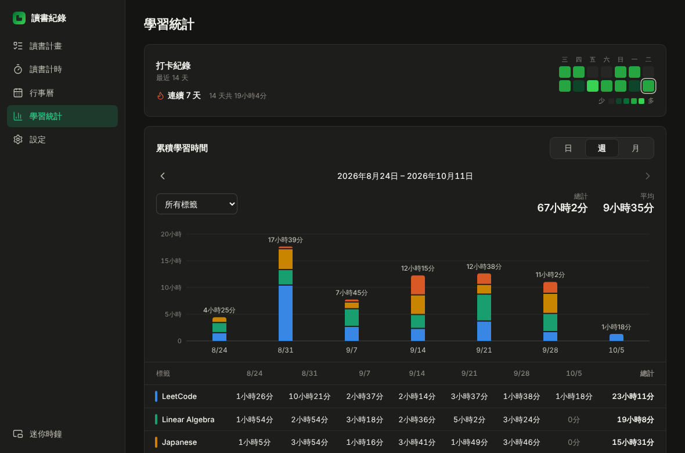

# Study Tracker

A small Windows desktop app for planning study sessions, timing them, and seeing your progress, with a focus on the next few days rather than months of history.

English and 繁體中文 (Taiwan) UI, light/dark theme, all data stored locally.

| Statistics | Study Clock |
|---|---|
|  |  |
| **Calendar** | **繁體中文 · dark** |
|  |  |

## Features

- **Study Plans:** create sessions with a title, date, start time, duration, one tag and a description. Each plan shows how much you have actually studied against it.
- **Study Clock:** stopwatch, countdown, or pomodoro (custom focus / short break / long break / rounds). Link a session to a tag or plan before you start, or afterwards from *Today's sessions*. Sessions shorter than one minute are not saved. You can also log time by hand.
- **Mini clock:** a small always-on-top window that stays in sync with the main clock.
- **Calendar:** today and the next two days on an hourly grid. Click an empty slot to add a plan; plans that run past midnight continue into the next day.
- **Statistics:**
  - *Check-in:* a 14-day GitHub-style grid (none / under 30 min / 30–60 min / 1–3 h / 3 h and more).
  - *Study time:* bar chart by day, week or month, split by tag, with a tag filter.
  - *By tag:* a table of each tag's time per period.
- **Notifications:** silent Windows notifications when a countdown ends or a pomodoro phase changes (can be turned off).
- **Backup:** export and import everything as one JSON file, in the same format the app stores on disk.

## Install (Windows)

Every push builds the Windows app on GitHub Actions. Open the repository's **Actions** tab, pick the latest **Build** run, and download the **StudyTracker-windows** artifact. It contains:

- `StudyTracker-Setup-x.y.z.exe`: installer
- `StudyTracker-Portable-x.y.z.exe`: a single exe that runs without installing

The app is not code-signed, so Windows SmartScreen may warn you the first time. Choose *More info → Run anyway*.

Your data lives in `%APPDATA%\Study Tracker\study-data.json`.

## Development

Requires Node.js 22+.

```bash
npm install
npm run dev        # run the desktop app with hot reload
npm run web        # run the UI in a browser at http://localhost:5199 (data in localStorage)
npm test           # unit tests
npm run typecheck
npm run dist:win   # build the Windows installer (run on Windows)
```

### Layout

```
src/
  shared/    plain TypeScript, no Electron: data model, store operations, timer engine,
             statistics, calendar layout, translations, and the StudyHost that ties them together
  main/      Electron main process: windows, IPC, file storage, notifications
  preload/   exposes the IPC API to the UI as window.studyApi
  renderer/  React UI (pages/, components/, styles.css)
```

The timer runs in the main process, so it keeps accurate time while the window is hidden, and the mini clock and main window always show the same session. A running session also survives restarting the app.
